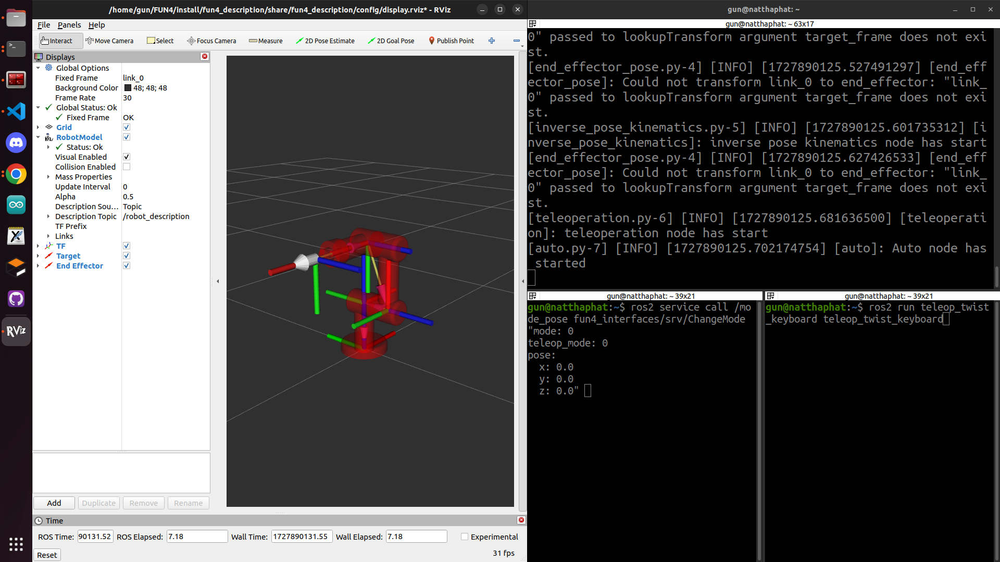
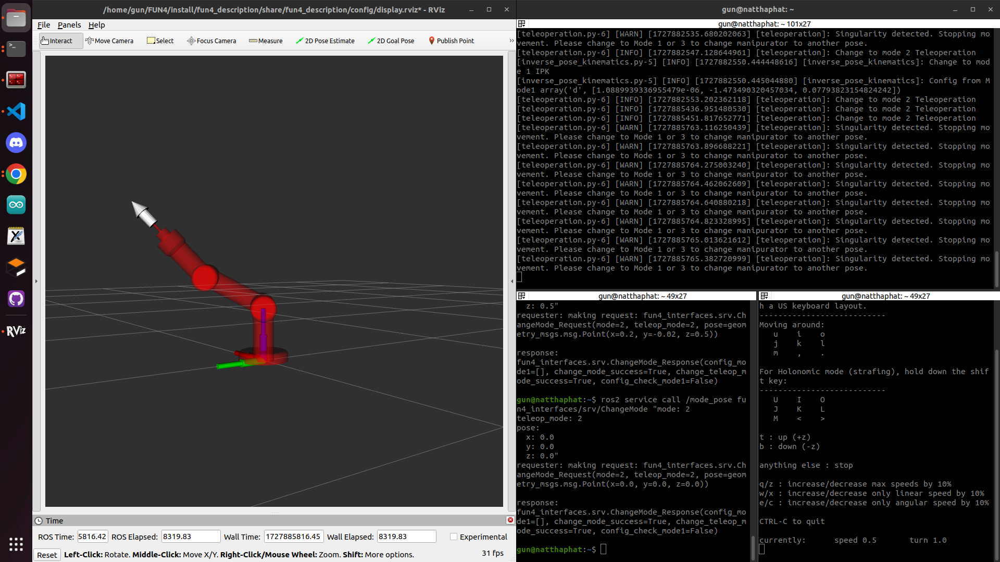
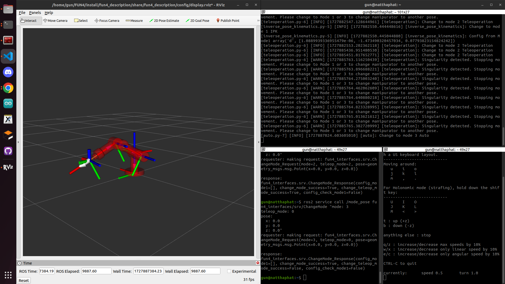

# FUN4_6523 
- # Design a system for controlling a 3 DOF robotic arm :mechanical_arm:

# Part -1: Install and setup environment in your computer.
## Install ROS2 Humble
[Install ROS 2 packages](https://docs.ros.org/en/humble/Installation/Ubuntu-Install-Debs.html)
**Note:** in *Desktop Install* you must install follow me.
```
sudo apt install ros-humble-desktop-full
```
and onother part You can follow the link I provided.
## Install dependencies
-   **install numpy version 1.23.5**
    ```bash
    pip3 install numpy==1.23.5
    ```
-   **install robotics toolbox for python**
    ```bash
    pip3 install roboticstoolbox-python
    ```
    **Note:**  When i import roboticstoolbox in code i have a error 
    ```bash
    ImportError: cannot import name 'plotvol3' from 'spatialmath.base.graphics'
    ```
    If you have same ploblem as me. you can copy this command in terminal home directory. If not you can pass this section.
    ```bash
    sudo apt-get remove python3-matplotlib
    # later on if you need to apt install packages, you will likely get:
    # E: Unmet dependencies. Try 'apt --fix-broken install' with no packages (or specify a solution).
    # doing that will unfortunately bring back python3-matplotlib.
    # Again, this is very hacky.
    ```
    It should work.
-   **install my project**

    Go to home directory.
    ```bash
    cd
    ```
    git clone my project and go in FUN4 directory.
    ```bash
    git clone https://github.com/G4CiO/FUN4.git
    cd FUN4/
    ```
    Build my project and install setup.bash.
    ```bash
    colcon build && . install/setup.bash
    ```
    Source my file in .bashrc for set environment.
    ```bash
    echo "source ~/FUN4/install/setup.bash" >> ~/.bashrc
    ```
# Part 0: launch and run my project
-   **open 3 terminals.**
    
    ## Terminals 1 for launch my project
    ```bash
    ros2 launch fun4_description fun.launch.py
    ```
    ## Terminals 2 for service call from terminal.
    ```bash
    ros2 service call /mode_pose fun4_interfaces/srv/ChangeMode "mode: 0
    teleop_mode: 0
    pose:
      x: 0.0
      y: 0.0
      z: 0.0"
    ```
    ### Description my variable in request.
    -   **mode**
        -   **mode = 1** is mode Inverse Pose Kinematics (IPK)
        -   **mode = 2** is mode Teleoperation
        -   **mode = 3** is mode Auto
    -   **teleop_mode**
        -   **teleop_mode = 1** is mode /cmd_vel that reference with base robot
        -   **teleop_mode = 2** is mode /cmd_vel that reference with end-effector
    -   **pose x, y, z**
        -  Is target Taskspace that user want end-effector go.

    ### Description my variable in response.
    -   **config_mode1**
        -   **config_mode1 = [q1_sol, q2_sol, q3_sol]** when find solution of Configuration space of robot arm from Taskspace that user key.
        -   **config_mode1 = [ ]** when not find solution of Configuration space or pose of Taskspace is out of workspace.
    -   **config_check_mode1**
        -   **config_check_mode1 = True** when find solution of Configuration space
        -   **config_check_mode1 = False** when not find solution of Configuration space or pose of Taskspace is out of workspace.
    -   **change_mode_success**
        -   **change_mode_success = True** when change Mode success
        -   **change_mode_success = False** when can't change Mode success or no that Mode that user key.
    -   **change_teleop_mode_success**
        -   **change_teleop_mode_success = True** when change mode /cmd_vel reference end-effector,base robot success
        -   **change_teleop_mode_success = False** when can't change mode /cmd_vel reference end-effector,base robot success or no that Mode that user key.


    ## Terminals 3 for control my robot arm 
    ```bash
    ros2 run teleop_twist_keyboard teleop_twist_keyboard
    ```

# Part 1: Setup Environment
-   **Find workspace of robot arm and how to check answer.** 
    You can see how to find ws and check answer in
    ```bash
    cd
    cd FUN4/src/
    code ../Workspace_check_sol.ipynb
    ```
-   **Disply random target end-effector in workspace of robot arm on RVIZ2**
    You will see it display on RVIZ2 when you run **mode 3 Auto**. Please continue to follow my instruction.

-   **Display pose end-effector on RVIZ2**
    You will see it display on RVIZ2 when you run **mode 3 Auto**. Please continue to follow my instruction.

# Part 2: Controller
-   ## Mode 1: Inverse Pose Kinematics (IPK)
    set x,y,z position in meter unit that you want to go in **Terminals 2**.
    -   **case 1:** x,y,z position in workspace. In this example i go to x = 0.4, y = -0.02, z = 0.5 meter.
        ```bash
        ros2 service call /mode_pose fun4_interfaces/srv/ChangeMode "mode: 1
        teleop_mode: 0
        pose:
          x: 0.4
          y: -0.02
          z: 0.5"
        ```
        Robot will move to target and you will recieved response like this.
        ```bash
        response:
        fun4_interfaces.srv.ChangeMode_Response(config_mode1=[6.584954803656728e-10, -1.28586463462304, -0.8935242362102285], change_mode_success=True, change_teleop_mode_success=False, config_check_mode1=True)
        ```
    -   **case 2:** x,y,z position not in work space. In this example i go to x = 1.0, y = 1.0, z = 1.0 meter.
        ```bash
        ros2 service call /mode_pose fun4_interfaces/srv/ChangeMode "mode: 1
        teleop_mode: 0
        pose:
          x: 1.0
          y: 1.0  
          z: 1.0"
        ```
        Robot will not move and you will recieved response like this.
        ```bash
        response:
        fun4_interfaces.srv.ChangeMode_Response(config_mode1=[], change_mode_success=True, change_teleop_mode_success=False, config_check_mode1=False)
        ```

-   ## Mode 2: Teleoperation
    control robot arm with topic /cmd_vel type Twist from teleop_twist_keyboard from terminal.
    -   **Teleop Mode 1: Reference with Robot Base**
        -   change **mode = 2** and **teleop_mode = 1** in **Terminals 2**.
        ```bash
        ros2 service call /mode_pose fun4_interfaces/srv/ChangeMode "mode: 2
        teleop_mode: 1
        pose:
          x: 0.0
          y: 0.0
          z: 0.0"
        ```
        -   run teleop_twist_keyboard in **Terminal 3** and push button from my description to control.
            ```bash
            ros2 run teleop_twist_keyboard teleop_twist_keyboard
            ```
            -   Description what each button does.
                -   hold key **"I"** = **+x** axis
                -   hold key **"<"** = **-x** axis
                -   hold key **"shift + J"** = **+y** axis
                -   hold key **"shift + L"** = **-y** axis
                -   hold key **"T"** = **+z** axis
                -   hold key **"B"** = **-z** axis

    -   **Teleop Mode 2: Reference with End-Effector**
        -   change **mode = 2** and **teleop_mode = 2** in **Terminals 2**.
        ```bash
        ros2 service call /mode_pose fun4_interfaces/srv/ChangeMode "mode: 2
        teleop_mode: 2
        pose:
          x: 0.0
          y: 0.0
          z: 0.0"
        ```
        -   run teleop_twist_keyboard in **Terminal 3** and push button from my description to control.
            ```bash
            ros2 run teleop_twist_keyboard teleop_twist_keyboard
            ```
            -   Description what each button does.
                -   hold key **"I"** = **+x** axis
                -   hold key **"<"** = **-x** axis
                -   hold key **"shift + J"** = **+y** axis
                -   hold key **"shift + L"** = **-y** axis
                -   hold key **"T"** = **+z** axis
                -   hold key **"B"** = **-z** axis     
    -   While control robot arm and found that robot near **Singularity**, robot will stop move and show warning on **Terminal 1**.
    **Example warning in teleop mode 2:**
    
    From picture it show warning in **Terminal 1** that say.
        ```bash
        [teleoperation.py-6] [WARN] [1727885765.382720999] [teleoperation]: Singularity detected. Stopping movement. Please change to Mode 1 or 3 to change manipurator to another pose.
        ```
        From warning you should **change to mode 1 or 3** to move robot arm to another pose.

-   ## Mode 3: Auto
    send request for random target in workspace to control robot arm move to target in 10 second. If robot arm reach to target or not move to target in 10 second robot will send request for new random target.
    -   First change to **mode = 3** in **Terminal 2**
        ```bash
        ros2 service call /mode_pose fun4_interfaces/srv/ChangeMode "mode: 3
        teleop_mode: 0
        pose:
          x: 0.0
          y: 0.0
          z: 0.0"
        ```
        Now robot will move auto to random target.
        
        # Note: If you see robot arm ***shake*** don't wory. If you wait 10 second after this situation robot will recieve new random target and can continue working.
